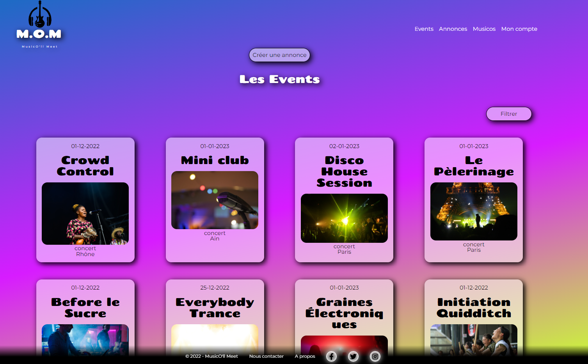

<h2 align=center>MusicO'll Meet</h2>

<a href="https://polite-digestion.surge.sh">https://polite-digestion.surge.sh</a>
 
 

<b>IMPORTANT:</b> disable AdBlock before testing the app.

It is a platform that aims to promote the organization of musical events, by facilitating the contact of musicians or groups (the Musicos) and the organizers (the MoMers). This app is a collaborative effort. I worked with 3 other studens of the school "O'Clock".

Here is how it works:

<ul>
    <li>The organizer creates an announcement;</li>
    <li>The musicians can apply (submit their candidature);</li>
    <li>The organizer can review the submission to accept or refuse  it;</li>
    <li>The organizer can finalize the announcement to turn it into an event after all of of the submissions have been reviewed.</li>
</ul>

All the users have the possibility to update their profile information, upload pictures, filter the events and delete their profile. The authentication is done using JWT.

<b>Stack:</b> Node.js Express, Postgres, Cloudinary, React, HTML, CSS.

<b>Backend repository:</b> <a href="https://github.com/senichek/musico-ll-meet-back">https://github.com/senichek/musico-ll-meet-back</a>
